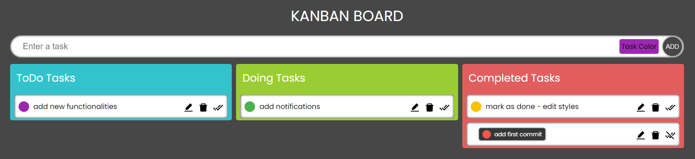

# Kanban Board
An application used to manage your tasks.<br />
Built with React, TypeScript, SCSS<br />
The following features have been implemented:
* Enter the task and set the color
* Drag'n'drop elements between columns
* Edit a task, delete or mark as done

TODO: notifications, mark as done - style, enable edit task color.
## Installation and Setup Instructions
Clone down this repository:
```bash
https://github.com/rnycz/kanban-board.git
```
Installation:
```bash
npm install
```
Start Server:
```bash
npm start
```
Visit App:
```bash
http://localhost:3000/
```
## Project Screenshot
 <br />