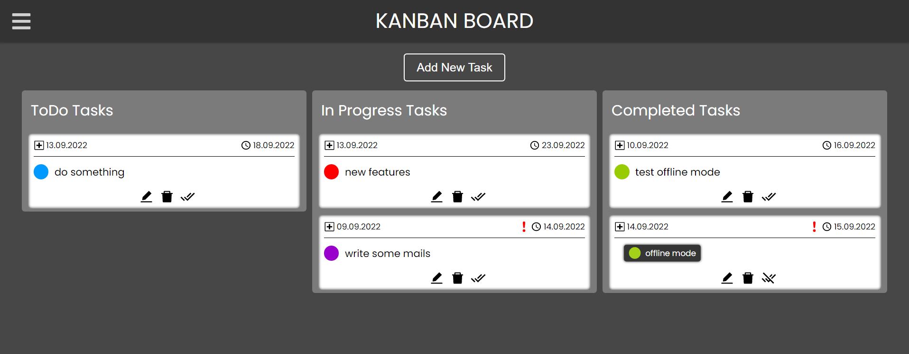
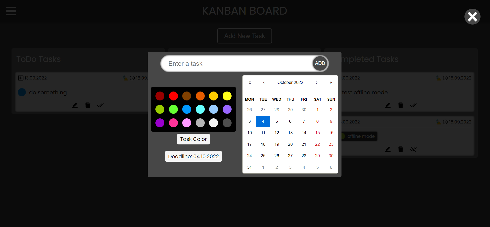
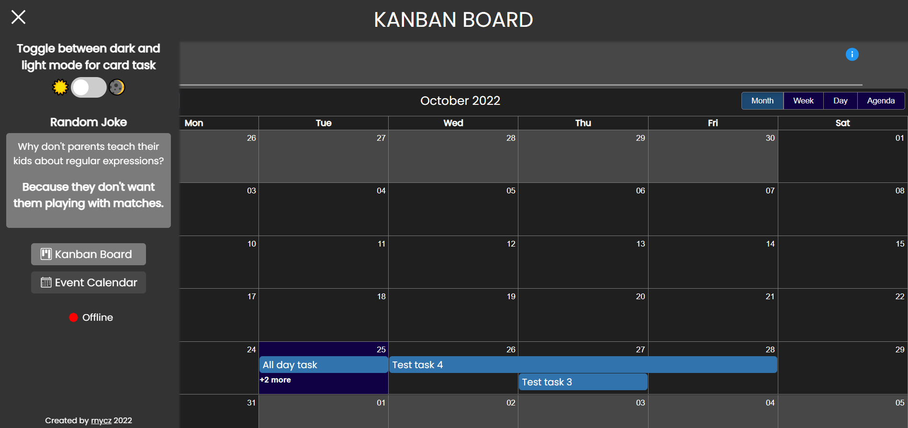

# Kanban Board

An application used to manage your tasks.<br />
Built with React, TypeScript, SCSS<br />
The following features have been implemented:

-   Enter the task, set the color and proposed end date for the task
-   Drag'n'drop elements between columns
-   Edit a task (color, text, finish task date), delete or mark as done
-   Notifications e.g. successfully edited a task
-   Sidebar with toggle button (dark/light mode for task cards) and random joke
-   Random joke fetched from [Dev Joke API](https://documenter.getpostman.com/view/16443297/TzkyLee7)

TODO: add MERN to enable login and register

## Installation and Setup Instructions

Clone down this repository:

```bash
git clone https://github.com/rnycz/kanban-board.git
```

Installation:

```bash
npm install
```

Start Server:

```bash
npm start
```

Visit App:

```bash
http://localhost:3000/
```

## Project Screenshots

 <br />
Add New Task modal window below <br />
 <br />
Sidebar with toggle button and random joke <br />
 <br />
